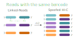

# :icon-tab-external: Spoof linked-read data into HI-C-like data

!!!danger
This is **very** experimental. Use at your own risk
!!!

The nature of HI-C data is such that paired-end reads in a FASTQ file are expected to be:
1. typically not adjacent to each other and hopefully quite far away
2. from the same strand of DNA

If you're familiar with what linked-reads are, you might think "oh hey, characteristic #2 sounds kind of similar
to what we do". Well, we think so too-- reads with the same barcodes _should_ have originated from the same original
strand of DNA. So, given how prevalent HI-C data is in genome assemblers (scaffolders specifically), couldn't we
modify linked-read data to also conform to characteristic #1? We're sure interested in figuring that out.

```bash usage
djinn hic-spoof a_felis_hic a_felis.R1.fq a_felis.R2.fq
```

## :icon-terminal: Running Options
{.compact}
| argument          | description                                                                   |
|:------------------|:------------------------------------------------------------------------------|
| `PREFIX`          | [!badge variant="info" text="required"] output filename prefix                |
| `INPUTS`          | [!badge variant="info" text="required"] FASTQ file pair **must be sorted by barcode**  |


## What it does
Reads with the same barcode will have their forward/reverse reads combinatorally
rearranged to mimic the long-range data captured with HI-C. The resulting
fastq files will be in TELLseq-ish format (original barcode appended
to sequence ID). The headers of the resulting FASTQ records will also have the last
three numbers in the sequence ID randomized to avoid identical read headers.

Below is an example of the process. If a barcode has two read pairs associated with it pair 1 = [1,1'] and pair 2 = [2,2'], the resulting "HI-C" data will be:
[1,1'], [1,2'], [2,1'], [2,2'].


